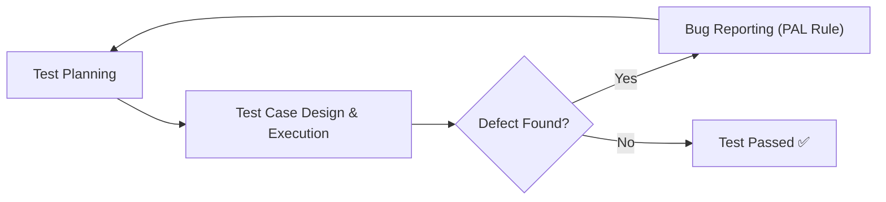

# 🎮 Game QA Fundamentals  

This repository is a learning project focused on **fundamentals of Game QA (Quality Assurance)**.  
It demonstrates how to plan, execute, and document test activities with **structured workflows and templates**.  

---

## 🧩 QA Workflow Demonstrated  

1. **Test Planning**  
   - Define overall QA goals and scope.  
   - 📄 Example: [Test Plan](docs/test-plan-example.md)  

2. **Test Case Design & Execution**  
   - Write step-by-step scenarios to validate features.  
   - 📄 Template: [Test Case Template](docs/test-case-template.md)  
   - 📄 Example: [TC-001 – Character stuck – Moving – Level 2 wall](docs/test-cases/TC-001.md)  

3. **Bug Reporting**  
   - Log discovered defects using the **PAL rule** (Problem – Action – Location).  
   - 📄 Template: [Bug Report Template](docs/bug-report-template.md)  
   - 📄 Example: [BUG-001 – Character stuck – Moving – Level 2 wall](docs/bug-reports/BUG-001.md)

---

## 🔄 QA Workflow Diagram  

---

## 🛠️ What You’ll Find Inside
- **Structured Templates** → For bug reports & test cases.  
- **Practical Examples** → A real test case and bug report.  
- **PAL Rule** → A naming convention for clarity and consistency.  

---

## 🚀 Purpose
This repository is part of my **QA learning journey** and serves as a portfolio piece.  
It shows how I approach testing games **systematically** — from planning, to test execution, to bug reporting.

---

## Automation Testing (Selenium + Python)
This repo also contains Selenium-based test automation examples inside the `automation/` folder.  
- Demonstrates browser automation (login forms, navigation, validation).  
- Uses Python and Pytest for test structure.  
- Complements manual QA workflows by showing how to automate repetitive test cases.

---

## 📖 Glossary
See the [Glossary](docs/glossary.md) for definitions of QA terms, abbreviations, and naming conventions (including the PAL rule).
